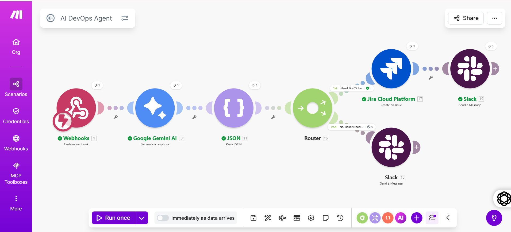

# AI-Powered DevOps Agent

## GitHub + Gemini AI + Jira + Slack Automation

## Goal

Reduce manual DevOps work in software teams by 90% using AI-powered automation.

## How It Works

1. Developer opens a **Pull Request** on GitHub
2. GitHub sends event to **Make.com** via Webhook
3. **Gemini AI** analyzes PR code and returns JSON review
4. **Router** checks if Jira ticket is needed
5. If yes → **Jira ticket** auto-created with full description
6. **Slack notification** sent to team with complete review

## Tech Stack

| Tool | Purpose |

|------|---------|
| Make.com | Core workflow automation |
| GitHub Webhooks | Real-time PR trigger |
| Gemini AI 1.5 Flash | Intelligent code review |
| Jira Cloud | Auto ticket creation |
| Slack | Team notifications |

## Features

- ✅ Auto PR code review using Gemini AI
- ✅ Confidence scoring (0-100) on every review
- ✅ Severity detection (low/medium/high)
- ✅ Jira ticket auto-created with AI description
- ✅ Slack real-time team alerts
- ✅ Zero backend code — fully no-code

## Workflow Flow

GitHub PR Event
      ↓
Make.com Webhook
      ↓
Gemini AI Review
      ↓
Parse JSON
      ↓
Router
   /        \
true        false
  ↓            ↓
Jira         Slack
Ticket +     Only
Slack

## Gemini AI Output Example

```json
{
  "summary": "PR adds a hello function. No tests included.",
  "severity": "low",
  "needs_jira_ticket": true,
  "ticket_title": "Add unit tests for hello function",
  "suggestion": "Consider adding unit tests",
  "confidence": 95
}
```

## Project Status

- [x] Phase 1 - GitHub Webhook setup
- [x] Phase 2 - Gemini AI code review
- [x] Phase 3 - Jira auto ticket creation
- [x] Phase 4 - Slack team notifications
- [ ] Phase 5 - Auto PR comment on GitHub
- [ ] Phase 6 - Daily summary reports

## Screenshots

### Make.com Scenario



### Jira Ticket Auto Created


### Slack Notification


